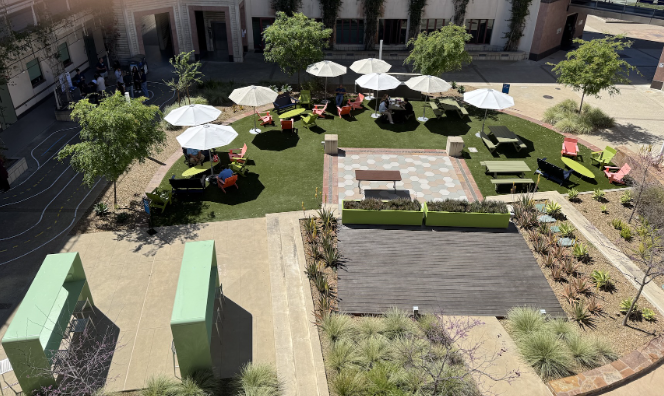
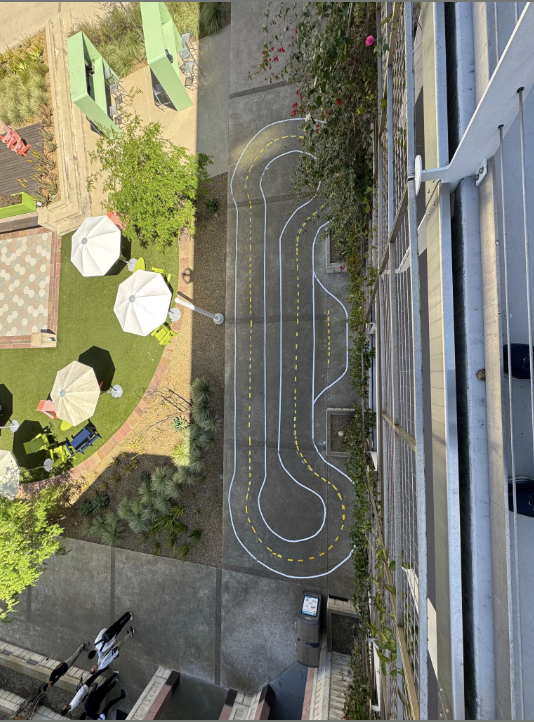
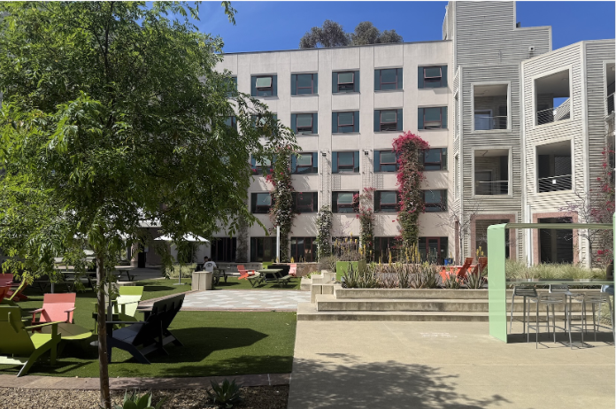
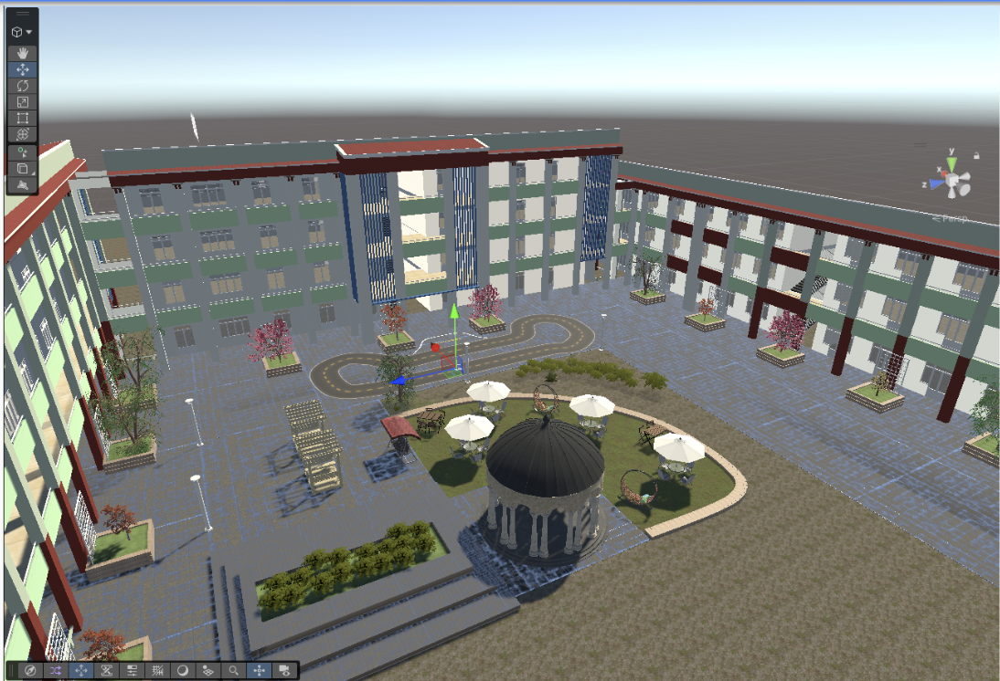
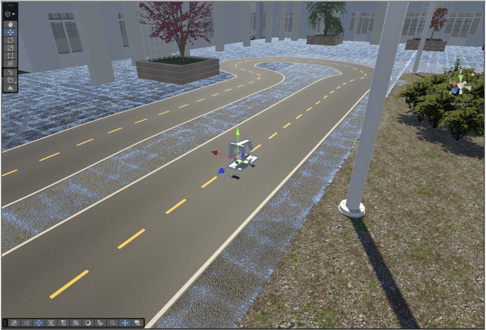

# Creating a Realistic Donkey Sim Track

**MAE 148 Final Project — ECE 148 WI 2026 | Team 13**

**Team:** Jing, Matt, Xane, and Lavar | UCSD Jacobs School of Engineering


---

## Overview

This project aimed to create a realistic simulation of the EBU2 Courtyard racing track for use with the Donkey Car simulator (DonkeySim), built in Unity. We successfully delivered an accurate, driveable representation of the track complete with the surrounding EBU2 courtyard environment including the building, umbrellas, trees, and other landmarks.

---

## Getting Started

Before opening Unity, clone the sdsandbox repo which provides the base DonkeySim Unity project:

```bash
git clone https://github.com/tawnkramer/sdsandbox/
```

Open the cloned project in Unity. This gives you the DonkeyCar prefab, ScenePrefab, camera sensor, and all other simulator assets needed to build and test the track.

---

## Goals & What We Achieved

| Goal | Status |
|---|---|
| Accurately mapped representation of racetrack in Unity | ✅ Done |
| Documentation | ✅ Done |
| Start integration of track into DonkeySim | ✅ Done |
| Map includes courtyard, EBU2 building, umbrellas, etc. | ✅ Done |

---

## Our Journey

### Step 1 — Read the ORB-SLAM3 Paper
We started by reading the ORB-SLAM3 paper to understand how simultaneous localization and mapping works and whether it could be used to map the racetrack.

### Step 2 — Tried ORB-SLAM3
We installed and ran ORB-SLAM3. The output looked strange — it produced quaternion-based pose data that didn't give us an intuitive or usable picture of the track layout. It was unclear how to turn this into something we could use in Unity directly.

### Step 3 — Tried OAK-D for Point Cloud Mapping
We got the OAK-D Pro and used DepthAI to generate a point cloud of the track. The result was noisy and hard to interpret — it didn't give us the clean geometry we needed to reconstruct the track. We also discovered the OAK-D Lite doesn't support 3D vision at all, which ruled it out earlier than expected.

### Step 4 — Just Built the Map in Unity (What Actually Worked)
Since our core goal was always to have an accurate track map, we pivoted to building it directly in Unity using a top-down overhead photo of the EBU2 Courtyard as a reference. This approach was straightforward and produced a high-quality, driveable track with the full surrounding environment.

---

## Future Direction

- Build out the courtyard area and make it fully driveable
- Use ORB-SLAM 3 data (x, y, z position + quaternions) to trace out the spline in Unity for a more precise track representation

---

## Lessons Learned

- Robotics projects like ORB-SLAM have many moving parts — it is difficult to anticipate all the hardware/software requirements necessary to complete initial goals.
- When running into unexpected roadblocks, it is important to improvise quickly and reshape goals to match timelines.
- Sometimes the simplest approach (overhead photo + Unity) is the most effective one.

---

## How to Create the Track in Unity

### Method 1: EasyRoads3D (Recommended for Flat Tracks)

This is the method that worked best for recreating the EBU2 Courtyard track.

1. **Install EasyRoads3D** from the Unity Asset Store (free version available)
2. **Import a top-down overhead photo** of the track into Unity as a reference image and place it flat on the ground plane
3. **Create a new road network** using the EasyRoads3D component in the scene
4. **Trace the track** by placing road nodes along the track outline using the overhead photo as a guide
5. **Adjust road width** to match the real-world track dimensions
6. **Build the road network** — EasyRoads3D will automatically generate the road mesh, markings, and side geometry
7. **Add surrounding environment assets** (buildings, trees, umbrellas, etc.) to match the real courtyard
8. **Test in DonkeySim** by placing the Donkey Car on the track and verifying the camera POV looks correct

**Tips:**
- Use the ScenePrefab from the sdsandbox repo — it provides all the base DonkeySim assets out of the box
- Match node placement carefully to the overhead photo to preserve track shape accuracy

---

### Method 2: Unity Spline Package (Better for Tracks with Hills)

Splines were explored early on but replaced by EasyRoads3D for this flat track. However, **splines have strong potential for tracks with elevation changes such as hills or ramps**, since you can move individual knots vertically to create rises and dips — something EasyRoads3D doesn't handle as cleanly.

1. **Install the Splines package** via Unity Package Manager (`com.unity.splines`)
2. **Import your top-down reference image** as a background guide
3. **Create a Spline object** in the scene and place knots along the track path
4. **Use Spline Extrude** to give the spline physical width, turning it into a driveable road mesh
5. **Adjust the cross-section profile** to control road width and edge shape
6. **For elevation/hills:** Move individual spline knots vertically (Y-axis) to create rises and dips

**Tips:**
- Splines give fine-grained control over 3D road shape — use tangent handles on knots to smooth out curves
- For purely flat tracks, EasyRoads3D is faster and easier to work with

---

## Reference vs. Final Product

### Reference Photos (Real EBU2 Courtyard)





### Final Product (Unity Simulation)




> **Note:** One of the buildings visible in the reference photos was intentionally removed from the Unity simulation. When driving the track and viewing from a top-down perspective, the building would obstruct the camera's view of the track, making it difficult to navigate.

---

## Known Issues & What Can Go Wrong

### Image Warping from Non-Overhead Shots
- **Problem:** If the overhead photo isn't taken from directly above (true vertical), the track shape will appear warped/distorted when used as a Unity reference
- **Fix:** Take the photo as close to perfectly vertical as possible — even a slight angle causes visible warping when tracing road nodes

### OAK-D Lite — No 3D Vision
- **Problem:** The OAK-D Lite does not support 3D depth/stereo vision
- **Fix:** Use the **OAK-D Pro** for any depth or point cloud work

### ORB-SLAM3 — Output is Hard to Interpret
- **Problem:** ORB-SLAM3 outputs camera pose as x, y, z + quaternion rotation values, which don't directly visualize as a track layout
- **Fix:** Post-process the output to extract only x, y, z translation data and use it to place spline knots in Unity — this is a promising future direction

### DepthAI Point Cloud — Noisy Data
- **Problem:** The point cloud from OAK-D Pro was noisy and did not produce clean track geometry
- **Fix:** Ensure good lighting, slow and steady camera movement, and sufficient scene texture for depth estimation to work correctly

### EasyRoads3D — Limited for Non-Flat Terrain
- **Problem:** EasyRoads3D works best on flat surfaces and doesn't handle elevation changes well
- **Fix:** For tracks with hills or ramps, use the Unity Splines package with Spline Extrude instead

---

## References

- [sdsandbox — DonkeySim Unity Project](https://github.com/tawnkramer/sdsandbox/)
- [ORB-SLAM3 Paper](https://arxiv.org/abs/2007.11898)
- [ORB-SLAM3 GitHub](https://github.com/UZ-SLAMLab/ORB_SLAM3)
- YouTube Tutorial for Creating Donkey Car Tracks
- How I Made a Kart Racing Track in Unity Fast
- How to Build Roads Procedurally In Unity with The Splines Package
- How to Get Started with The Splines Package
- [EasyRoads3D - Free Version](https://assetstore.unity.com/packages/tools/terrain/easyroads3d-free-v3-987)
- Trees (Unity Asset Store)
- [Real-Time Appearance-Based Mapping (RTAB)](http://introlab.github.io/rtabmap/)
